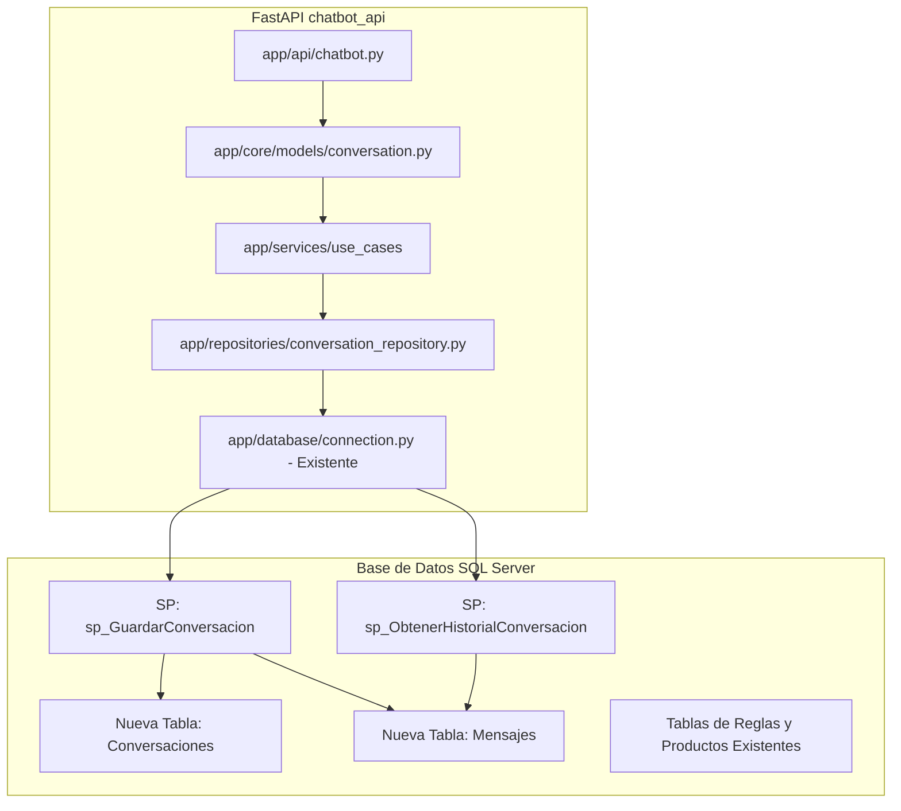

 Reporte de Análisis Técnico y Plan de Integración (No Destructivo)

Este documento presenta un análisis exhaustivo del código actual del Chatbot y del código del Anexo proporcionado por el docente, localizados en el directorio [BASECHATBOT](file:///C:/hector/E_COMMERCEDEV/Database/BASECHATBOT). El objetivo principal es identificar las diferencias clave, qué elementos hacen falta y proponer una estrategia detallada para integrar el anexo sin alterar ni dañar el funcionamiento actual.

---

 1. Arquitectura y Componentes Actuales del Chatbot

El sistema existente funciona bajo un enfoque de procesamiento basado en reglas de base de datos y un flujo directo en la API:

 1.1 Base de Datos (`DB_EcommerceAgent.sql` y Procedimientos Almacenados)
 Reglas Dinámicas y Respuestas: Cuenta con tablas específicas para parametrizar el comportamiento del bot:
   `ReglasChatbot`: Define las intenciones/reglas de control (ej. saludos, métodos de pago, despedidas) y si ejecutan lógica en Python.
   `PalabrasClaveRegla`: Palabras detonantes asociadas a cada regla.
   `PlantillasRespuesta`: Mensajes plantilla de respuesta asociados a cada regla.
 Historial Tradicional:
   `HistorialConversaciones` e `HistorialMensajes` registran el chat de manera plana con IDs numéricos autoincrementales (`BIGINT`).
 Lógica en Base de Datos:
   [SP_ProcesarMensajeChatbot](file:///C:/hector/E_COMMERCEDEV/Database/BASECHATBOT/sp/BORRADOR_SP_CON_REGLAS_Y_CONSUMO_SP_FILTRO_DINAMICO_CONSULTA_GENERAL/sp_procesar_mensaje_chatbot_conreglas_y_consumo_de_sp_de_filtroV4.sql): Centraliza el flujo. Si el mensaje coincide con palabras clave de control, recupera una plantilla de respuesta. Si no, activa por defecto la búsqueda de productos invocando a `dbo.SP_ListarGeneralProducts_Filtro`, formatea el resultado en base a stock y devuelve el texto final.

 1.2 Aplicación Backend (`chatbot_api/app`)
 Framework: FastAPI.
 Endpoints Activos ([main.py](file:///C:/hector/E_COMMERCEDEV/Database/BASECHATBOT/chatbot_api/app/main.py)):
   `GET /api/chatbot/rules`: Carga las reglas dinámicas desde BD ([reglas_repository.py](file:///C:/hector/E_COMMERCEDEV/Database/BASECHATBOT/chatbot_api/app/repositories/reglas_repository.py)).
   `POST /api/chatbot/chat`: Recibe un JSON plano `{ "mensaje": "..." }` y procesa el mensaje a través de base de datos.
   `WS /ws/chat`: WebSocket para mensajería en tiempo real que ejecuta el mismo pipeline.
 Infraestructura:
   Conexión a BD dinámica con `.env` y variables de entorno ([connection.py](file:///C:/hector/E_COMMERCEDEV/Database/BASECHATBOT/chatbot_api/app/database/connection.py)).

---

 2. Componentes del Anexo (Entregado por el Docente)

El anexo propone un enfoque basado en Clean Architecture (Arquitectura Limpia) y el almacenamiento estructurado de conversaciones en formato JSON:

 2.1 Base de Datos (`SQL/Conversaciones_Chatbot.sql`)
 Tablas de Historial Estructurado:
   `Conversaciones`: Utiliza un ID tipo cadena de texto (`ConversationId NVARCHAR(50)`) en lugar de numérico. Almacena variables de sesión como `Language`, `LastIntent`, `CartId` y `OrderId`.
   `Mensajes`: Almacena el rol (`Role`), marca de tiempo (`Timestamp`), la intención detectada (`Intent`), el contenido del texto (`Content`), y un campo `Metadata NVARCHAR(MAX)` para almacenar metadatos en formato JSON.
 Lógica en Base de Datos:
   `sp_GuardarConversacion`: Recibe un JSON completo que representa el estado completo de la conversación y sus mensajes. Utiliza la función `OPENJSON` de SQL Server para extraer datos principales y variables de sesión anidadas, insertando todo de una sola vez en las tablas de `Conversaciones` y `Mensajes`.
   `sp_ObtenerHistorialConversacion`: Recupera los mensajes históricos ordenados por fecha y hora para una conversación dada.

 2.2 Código Python (`anexo_dado_por_el_docente`)
 Domain (Entidades):
   [conversation.py](file:///C:/hector/E_COMMERCEDEV/Database/BASECHATBOT/anexo_dado_por_el_docente/domain/entities/conversation.py): Esquemas de Pydantic (`Metadata`, `Message`, `Context`, `Conversation`, `ConversationRequest`) que reflejan la estructura JSON.
 Use Cases (Casos de Uso):
   `ProcesarConversacionUseCase` y `ObtenerHistorialUseCase` que encapsulan la lógica de negocio y desacoplan los controladores del repositorio.
 Infrastructure:
   [conversation_repository.py](file:///C:/hector/E_COMMERCEDEV/Database/BASECHATBOT/anexo_dado_por_el_docente/infraestructure/repositories/conversation_repository.py): Invoca los SPs de base de datos pasando la conversión JSON del modelo.
   [connection.py](file:///C:/hector/E_COMMERCEDEV/Database/BASECHATBOT/anexo_dado_por_el_docente/infraestructure/database/connection.py): Conexión con credenciales quemadas (`UserPython` / `12345678`).
 Presentation:
   `conversation_controller.py`: Router de FastAPI que expone `/chatbot/conversation` y `/chatbot/obtenerconversation`.

---

 3. Comparativa y Brechas Identificadas (Qué Hace Falta)

| Criterio | Implementación Actual | Anexo del Docente | Brecha / Qué hace falta |
| :--- | :--- | :--- | :--- |
| Tablas de Historial | `HistorialConversaciones`, `HistorialMensajes` (IDs numéricos `BIGINT`) | `Conversaciones`, `Mensajes` (IDs tipo texto `NVARCHAR(50)`, soporte JSON) | Crear las nuevas tablas del anexo en la base de datos. |
| Persistencia de Conversación | Inserciones individuales por mensaje mediante SP procedural clásico. | Inserción en lote extrayendo campos de un JSON unificado mediante `sp_GuardarConversacion`. | Crear los nuevos SPs (`sp_GuardarConversacion` y `sp_ObtenerHistorialConversacion`). |
| Modelado de Datos | Modelos planos y orientados a peticiones simples. | Entidades estructuradas complejas con Pydantic (`Conversation`, `Message`, `Context`). | Mapear y registrar estos modelos en la estructura de la aplicación. |
| Lógica de Negocio | Centralizada a nivel de base de datos (SP) y servicios directos. | Desacoplada usando Casos de Uso (`domain/use_cases`). | Implementar o estructurar los Casos de Uso dentro de la API. |
| Conexión a BD | Dinámica mediante variables de entorno y `.env`. | Estática con credenciales hardcoded (`UserPython`). | Adaptar el repositorio del anexo para usar el `connection.py` dinámico existente en la API. |

---

 4. Plan de Integración No Destructivo

Para incorporar todo lo propuesto por el docente sin romper ni alterar el buscador inteligente de productos ni el motor de reglas actual, seguiremos un plan de integración modular:



 Paso 1: Extensión del Esquema de Base de Datos
 Acción: Ejecutar el script SQL del docente para crear las tablas `Conversaciones`, `Mensajes` y los procedimientos almacenados `sp_GuardarConversacion` y `sp_ObtenerHistorialConversacion`.,

aqui vamos a modificar la base de datos la query que tien als tabals para anexasr estas tablas se agregan al final y se adapta al sistema que nosotro ya tenemos, cabe resaltar que loq ue brindo el docente es solo ejemplo y nosotros debedemos de adapatar a nuestro proyecto no adaptar nuestro proyecto a lo que dio el docente
 Seguridad: Al usar nombres de tablas diferentes a los del historial clásico (`HistorialConversaciones`), no hay conflicto de nombres, lo que garantiza impacto cero en el flujo actual.
= aqui por eso emnciono que nosotro ssolo usamos la logica mas y la adaotacion para nuestro proyecto 

 Paso 2: Integración de Modelos de Dominio (Entities)
 Acción: Copiar los esquemas de Pydantic (`Conversation`, `Message`, etc.) del anexo a la estructura del proyecto actual.
 Ubicación propuesta: `chatbot_api/app/core/models/conversation.py` o en un nuevo directorio `chatbot_api/app/domain/entities/conversation.py`.
 debe de quedar bien acoplado y que la arqutectura quede limpia y sin comentarios todo bien adaptado y explisito  en las query hay que agregar las tabls y crear una nueva query con los sp que hacen falta par hcr que el flujo quede bien
 Paso 3: Integración del Repositorio Adaptado
 Acción: Crear el repositorio `app/repositories/conversation_repository.py`.
 Modificación clave: En lugar de importar la conexión quemada del anexo, importará y utilizará la conexión segura existente:
  ```python
  from app.database.connection import get_connection
  ```
  Esto garantizará que el código del docente funcione en desarrollo, pruebas y producción sin tener que cambiar credenciales en código.

 Paso 4: Incorporación de Casos de Uso
 Acción: Copiar los casos de uso (`procesar_conversacion.py` y `obtener_historial.py`) a una subcarpeta de servicios como `app/services/use_cases/`.

 Paso 5: Exposición de Endpoints en el Controlador
 Acción: Incorporar los dos nuevos endpoints en la API.
 Estrategia: Para mantener el código limpio y ordenado, se sugeriría crear un nuevo archivo de rutas `app/api/conversations.py` para estos nuevos endpoints de historial estructurado y registrarlo en `app/main.py`:
  ```python
  from app.api.conversations import router as conversations_router
  app.include_router(conversations_router)
  ```
  This will avoid overloading the current `app/api/chatbot.py`.

---

 5. Pruebas de Validación Sugeridas

Una vez que se decida realizar la implementación, se recomienda probar:
1. Prueba de Regresión: Enviar mensajes a `/api/chatbot/chat` y por WebSocket `/ws/chat` para verificar que el buscador y el sistema de reglas por BD siguen respondiendo correctamente y registrando en el historial clásico.
2. Prueba de Nuevos Endpoints: Enviar un JSON de conversación completo al nuevo endpoint `POST /api/chatbot/conversation` y comprobar que se almacena correctamente en las nuevas tablas usando `sp_GuardarConversacion`.
3. Prueba de Historial: Consultar el endpoint de obtención de historial para el ID de conversación insertado y verificar la correcta deserialización del JSON de `Metadata`.
